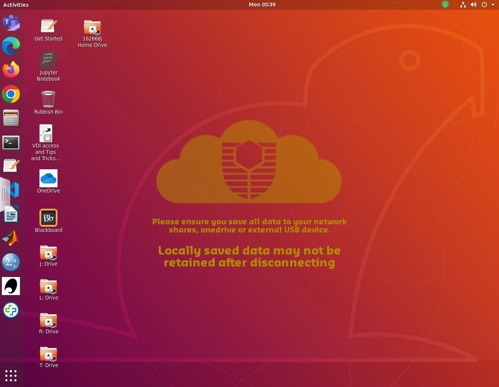

:::::::::::::::::::::::::::::::::::::: questions 

- How do I login in to the Virtual Machines?
- Where do I find and access files in Linux?
- How do I create and run a program using Linux?
 
::::::::::::::::::::::::::::::::::::::::::::::::

::::::::::::::::::::::::::::::::::::: objectives

- Define and use key commands in the Linux operating system
- Edit files using vim
- Run simple Python code in a Linux environment 

::::::::::::::::::::::::::::::::::::::::::::::::

### Introduction

This practical will give a gentle introduction to Linux. It can be done before 
or after the first lecture - but do not delay as we'll need everything from 
this lesson to build on in future weeks.

In class you will be accessing a Linux environment (operating system) through
a web browser. We will connect to a Virtual Machine - using servers in
the cloud which can run multiple "virtual" machines at once. These, in turn, 
connect to fileservers where you can store your files and access them from
any Curtin computer, or from your home machine(s).

:::::::::::::::::::::::::::::::::::::::::::::::::::::::::::::::::::: Note

**Note:** If you are working remotely, or are not on Bentley Campus, you may have 
an alternative setup to access Linux. Your Lecturer will guide you through
Activity 0.

::::::::::::::::::::::::::::::::::::::::::::::::::::::::::::::::::::::::::::::::

That may be too much information for right now... so let's dive in and find out 
how to use Linux!

### Activity 1 - Accessing Linux

In the laboratory:

1. login to the machines with your Oasis login. 
2. Once you're connected, open a web browser and go to [mydesktop.curtin.edu.au](https://mydesktop.curtin.edu.au).
3. You can choose either the install or HTML option, but for the labs we will 
use **VMware Horizon HTML Access**. You'll need to login again, making sure to select
**STUDENT**. 
4. Choose either **Computer Science Linux Lab** or **Curtin Global Linux** - this tells 
the system which flavour of operating system you want to use. (they are both the same, 
but can be useful as options when we have technical issues)
5. It will take a few minutes for all the icons to arrive, so this is a good time to get 
your screens setup - one for the prac sheet/page and the other for working in Linux 
is recommended.
6. Your screen should look something like this...

{alt="Starting screen for Linux with
icons loaded"}

### Activity 2 - The Command Line

Now we need to open a **terminal window** to interact with the Linux computer. There is
a graphical (GUI) interface, however the command line is more powerful (eventually).

The terminal application is on the left of the screen (a black rectangle). We can make 
sure it points to the correct area for your files by opening the **I: drive** icon and
then right-clicking to get a pop-up menu and select **open in terminal**.

There are a lot of commands you can use in Linux, but you only need a few 
to get started. A sample of the Unix commands available to
you have been provided below. We will learn more commands as we go through the unit.

Try typing the following commands one at a time and check what they do...

```
ls
ls –l
pwd
mkdir test
ls
cd test
ls
ls –la
```

:::::::::::::::::::::::::::::::::::::::::::::::::::::::::::::::::::: callout

Now it's time for you to do some coding!

```python
print("Hello world!")
```

::::::::::::::::::::::::::::::::::::::::::::::::::::::::::::::::::::::::::::::::


the < > braces are just a convention to show something that you
fill in. Note that in Unix/Linux folders are referred to as directories.

::::::::::::::::::::::::::::::::::::: challenge 

## Challenge 1: Can you do it?

What is the output of this command?

```r
paste("This", "new", "lesson", "looks", "good")
```

:::::::::::::::::::::::: solution 

## Output
 
```output
[1] "This new lesson looks good"
```

:::::::::::::::::::::::::::::::::


## Challenge 2: how do you nest solutions within challenge blocks?

:::::::::::::::::::::::: solution 

You can add a line with at least three colons and a `solution` tag.

:::::::::::::::::::::::::::::::::
::::::::::::::::::::::::::::::::::::::::::::::::

### And that's the end of Practical 0!

::::::::::::::::::::::::::::::::::::: keypoints 

- We will be using Linux as our operating system for this unit
- You can access Linux through [mydesktop.curtin.edu.au](https://mydesktop.curtin.edu.au) or install Python and a "Linux" shell on your home machine
- Working on the command line, we will type in commands at the prompt, press enter, and wait for the computer's response
- To create and edit a text file, we will be using vim - a program for editing text files
- Once we have entered a Python program as a text file, with a ".py" extension, we can run the program by typing `python3 myprog.py`

::::::::::::::::::::::::::::::::::::::::::::::::

