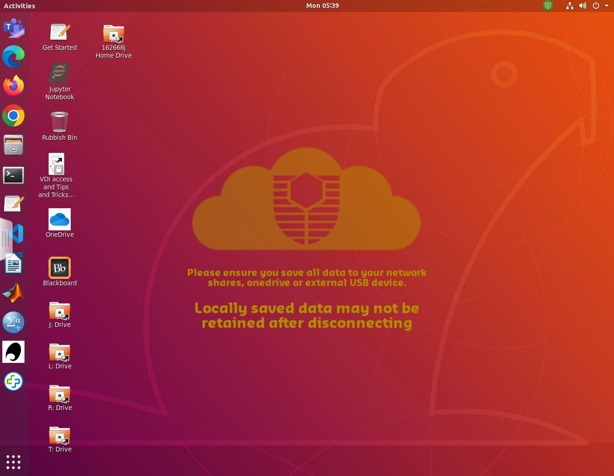

<!-- Google Tag Manager (noscript) -->
<noscript><iframe src="https://www.googletagmanager.com/ns.html?id=GTM-K9NDRPSX"
height="0" width="0" style="display:none;visibility:hidden"></iframe></noscript>
<!-- End Google Tag Manager (noscript) -->
:::::::::::::::::::::::::::::::::::::: questions 

- How do I login in to the Virtual Machines?
- Where do I find and access files in Linux?
- How do I create and run a program using Linux?
 
::::::::::::::::::::::::::::::::::::::::::::::::

::::::::::::::::::::::::::::::::::::: objectives

- Define and use key commands in the Linux operating system
- Edit files using vim
- Run simple Python code in a Linux environment 

::::::::::::::::::::::::::::::::::::::::::::::::

### Introduction

This practical will give a gentle introduction to Linux. It can be done before 
or after the first lecture - but do not delay as we'll need everything from 
this lesson to build on in future weeks.

In class you will be accessing a Linux environment (operating system) through
a web browser. We will connect to a Virtual Machine - using servers in
the cloud which can run multiple "virtual" machines at once. These, in turn, 
connect to fileservers where you can store your files and access them from
any Curtin computer, or from your home machine(s).

:::::::::::::::::::::::::::::::::::::::::::::::::::::::::::::::::::: Note

**Note:** If you are working remotely, or are not on Bentley Campus, you may have 
an alternative setup to access Linux. Your Lecturer will guide you through
Activity 0.

::::::::::::::::::::::::::::::::::::::::::::::::::::::::::::::::::::::::::::::::

That may be too much information for right now... so let's dive in and find out 
how to use Linux!

### Activity 1 - Accessing Linux

In the laboratory:

1. login to the machines with your Oasis login. 
2. Once you're connected, open a web browser and go to [mydesktop.curtin.edu.au](https://mydesktop.curtin.edu.au).
3. You can choose either the install or HTML option, but for the labs we will 
use **VMware Horizon HTML Access**. You'll need to login again, making sure to select
**STUDENT**. 
4. Choose either **Computer Science Linux Lab** or **Curtin Global Linux** - this tells 
the system which flavour of operating system you want to use. (they are both the same, 
but can be useful as options when we have technical issues)
5. It will take a few minutes for all the icons to arrive, so this is a good time to get 
your screens setup - one for the prac sheet/page and the other for working in Linux 
is recommended.
6. Your screen should look something like this...



### Activity 2 - The Command Line

Now we need to open a **terminal window** to interact with the Linux computer. There is
a graphical (GUI) interface, however the command line is more powerful (eventually).

The terminal application is on the left of the screen (a black rectangle). We can make 
sure it points to the correct area for your files by opening the **I: drive** icon and
then right-clicking to get a pop-up menu and select **open in terminal**.

There are a lot of commands you can use in Linux, but you only need a few 
to get started. A sample of the Unix commands available to
you have been provided below. We will learn more commands as we go through the unit.

Try typing the following commands (one at a time) and check what they do...

```
ls
ls –l
pwd
mkdir test
ls
cd test
ls
ls –la
```

Here are a few of the most common commands... the < > braces are a convention to 
indicate text that you replace. Note that in Unix/Linux folders are referred to as directories.

| Command | Description | Examples | 
|---------|-------------|----------|
| ls | Lists all files in the current directory, if an argument is provided lists all files in the specified directory. | ls, ls –l, ls –la |
| cp <src> <dest> | Copies the file from source to destination. | cp Downloads/test.py ., cp test.py test2.py |
|mv <src> <dest> | Moves the file from source to destination. If the destination ends in a file name it will rename the file. | mv test.py Prac1, mv test.py mytest.py |
| pwd  | Lists the directory you are currently in (Print Working Directory) | pwd |
| cd <dir>  | Moves to <dir> | |
| mkdir <dir> | Creates a new directory | mkdir Prac1 |
| rm <filename> | Removes a file | rm fireballs.py |
| rmdir <dir> | Removes a directory (must be empty first) | rmdir Prac12 |
 
Using these commands create the following directory structure within your home
directory. A *How to use Unix* and cheatsheet document has been uploaded to
Blackboard, it will be helpful if you get stuck. Note you can use the arrow keys to get 
back to previous commands, and can use <tab> to complete long filenames.
 
* FOP
  * Prac00
  * Prac01
  * Prac02
  * Prac03
  * Prac04
  * Prac05
  * Prac06
  * Prac07
  * Prac08
  * Prac09
  * Prac10
  * Prac11
 
The current directory is referenced by a single fullstop (.), the parent directory is
referenced by two fullstops (..) and all pathways are relative to the current location.

For example...
 
```
cd FOP/Prac01
cd ../Prac00
```

...takes you into FOP/Prac01, then on the second line, back up and into Prac00


### Activity 3 - Introduction to the Text Editor (vim)
 
We are going to use the vim text editor to create your README file for Prac01. Vim
is an enhanced version of vi – a visual, interactive editor. There is an Introduction to
Vi document and a “cheat-sheet” on Blackboard, but you should work through this prac before 
try ing it.
 
If you're not already there, change directory into the Prac00 directory and create the README file:

```
> cd Prac00
> vim README
```
 
You will now be in the vim text editor with an empty file. Vim has two modes –
command mode (where you can move around the file and use commands) and insert
text mode. Type “i” to go into insert mode and type in the following README
information for Practical 1.
 
```
## Synopsis
Practical 0 of Fundamentals of Programming COMP1005/5005
 
## Contents
README – readme file for Practical 0
 
## Dependencies
none
 
## Version information
<today’s date> - initial version of Practical 0 programs
```
 
Press ```<esc>``` to exit insert mode, then :wq to save the file (w) and exit vim (q).
Type 
```
ls -l
```
 
(-l for long listing) and you will see that you have created a file called README, and it has
a size and a date. We will make README files for all of our practicals to hold
information about the files in that directory.

### Activity 4 - Welcome to Python!
 
Below is a simple program to get you used to the editor and running python scripts.
To create a file for the program, type:
 
```
vim hello.py
```
 
Then type in the following code... It is important to type it yourself and not copy/paste
– this is how you will learn and remember!

```python
#
# hello.py: Print out greetings in various languages
#
print('Hello')
print("G'day")
print('Bula')
print("Kia ora")
```

To run the program, type:
 
```
python3 hello.py
```
 
You will probably get an error message as a response (unless you typed it in
perfectly). Don’t worry, check through your code for the error and try running it again.
Go back into the file and make corrections – use the cursor keys to get to the position
(<lineno>G). Some handy editing commands are:
 
* to delete a character type “x”
* to delete a line “dd”
* to delete a word “dw”
* to change a word “cw”
* to insert/append after the end of the current line, type “A”
* to undo the last command, type “u”
* to redo the last command, type “.”

Save the file and try to run it again. If you’re having trouble, ask your tutor, or even
the person next to you, to see if they can find what’s wrong. Sometimes it takes
someone else’s fresh and/or experienced eyes to see an error. This is called
“debugging” and the reward comes when the code finally runs!

Try adding some more greetings of your own...

 
### Activity 5 - Updating the README
 
You now have a program and a README in the Prac00 directory. Enter the name of each of them
along with a description under “Contents” in the README file.

### Activity 6 - Making and submitting a zip file
 
To bundle up and compress files we can use zip/unzip. Similar programs are tar
(Tape Archive) and gzip (GNU zip).
 
To make a zipped file for Practical 0, go to the Prac00 directory inside your FOP
directory. Type pwd to check that you are in the right place.
 
Create the zip file by typing:

```
zip Prac00_<your_student_ID> *
 
e.g. zip Prac00_12345678 *

```
 
This will create a file **Prac00_<your_student_ID>.zip** which includes
everything in your current directory – one program and the README. You can check the
contents of the zip file by typing:

```
unzip –l Prac00_<your_student_ID>.zip
```
 
### Activity 7 - Submission

All of your work for this week’s practical should be submitted via Blackboard using
the Practical 0 link. This should be done as a single "zipped" file.
This is the file to submit through Blackboard. 
 
There are no direct marks for these
submissions, but they may be taken into account when finalising your mark.
Go to the Assessment link on Blackboard and click on Practical 0 for the submission
page.

### And that's the end of Practical 0!

::::::::::::::::::::::::::::::::::::: keypoints 

- We will be using Linux as our operating system for this unit
- You can access Linux through [mydesktop.curtin.edu.au](https://mydesktop.curtin.edu.au) or install Python and a "Linux" shell on your home machine
- Working on the command line, we will type in commands at the prompt, press enter, and wait for the computer's response
- To create and edit a text file, we will be using vim - a program for editing text files
- Once we have entered a Python program as a text file, with a ".py" extension, we can run the program by typing `python3 myprog.py`

::::::::::::::::::::::::::::::::::::::::::::::::

:::::::::::::::::::::::::::::::::::::::::::::::: checklist

### Reflection
 
1. **Knowledge:** What are the two modes in vi / vim?
2. **Comprehension:** What is the name of the lab machine you are working on?
Hint: use the hostname command or look at the prompt.
3. **Application:** What series of commands would you need to go to the directory
FOP/assignment in your home directory and compress all the files?
4. **Analysis:** The code ```print("G'day")``` uses two types of quotation marks (single and double). 
What would happen if they were all single quotes?
5. **Synthesis:** The code in ```hello.py``` is a bit repetitious. What commands in vim can help you
save time writing such code? (hint: you can copy and paste the common code, then edit it)
6. **Evaluation/Reflection:** What part of the prac did you find most challenging? (You can
give feedback to the lecturer/tutor...)
 
::::::::::::::::::::::::::::::::::::::::::::::::

:::::::::::::::::::::::::::::::::::::::::::::::: challenge

For those who want to explore a bit more of the topics covered in this practical.

2. Work through a Linux tutorial
3. Work through a vi/vim tutorial
4. Read some samples of README files for large projects -
https://github.com/matiassingers/awesome-readme
 
::::::::::::::::::::::::::::::::::::::::::::::::
 
