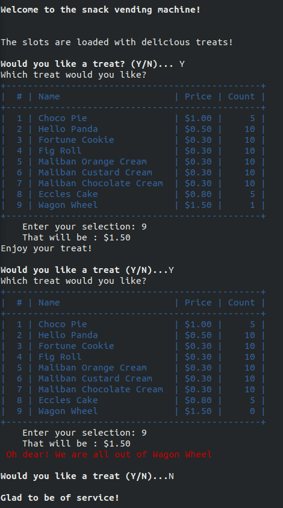
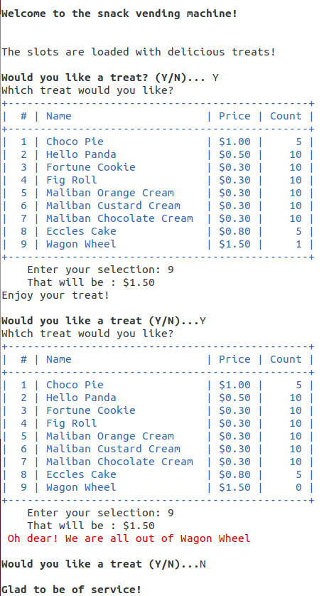

:::::::::::::::::::::::::::::::::::::: questions 

- How do I work with string values and variables?
- How do I access the elements of strings and lists?
- How can I use random numbers to simulate real world situations?
 
::::::::::::::::::::::::::::::::::::::::::::::::

::::::::::::::::::::::::::::::::::::: objectives

1. Define and use more complex datatypes (strings and lists) and variations on control structures
2. Use slicing and indexing to access elements in a list
3. Use a supplied Python package to provide random number options
4. Understand and implement simple Monte Carlo algorithms

::::::::::::::::::::::::::::::::::::::::::::::::

### Introduction

In this practical we will enter and modify programs to work with and explore strings and lists. We will then use random numbers to select list items without replacement.
The final two tasks will implement two Monte Carlo algorithms: calculating Pi and tossing coins.

### Activity 1 - Setting up for the practical

Login to the computers as in Practical 1. Within your home directory (/home/student_id) you should have the following structure:

```
FOP
 |-- Prac00
 |-- Prac01
 |-- Prac02
 |-- Prac03
 |-- Prac04
 |-- Prac05
 |-- Prac06
 |-- Prac07
 |-- Prac08
 |-- Prac09
 |-- Prac10
 |-- Prac11
```

Type ```ls FOP``` from your home directory to check your directory structure.

We will be working in the ```Prac02``` directory today. If you do not have the directory
structure correct, your tutor can help you to rearrange it.

Copy the ```README``` file from your ```Prac01``` directory to your ```Prac02``` directory. Use
```cp ../Prac01/README .``` from within the ```Prac02``` directory, then ```vim README``` to edit. 
Update the ```README``` to refer to ```Prac02``` and include the correct date.


### Activity 2 - Everybody loves string(s)!

Strings are very important in Python and the language provides powerful options to manipulate 
strings. The code below shows three different approaches to printing out a string in reverse: 
**while** loops; **for** loops and using **slicing**. 

Enter the following code as ```strings1.py```...

```python
#
# strings1.py: Read in a string and print it in reverse
#              using a loop and a method call

instring = input('Enter a string... ')

# *** add (2) upper and (3) duplicating code here

# reversing with a while loop
print('Reversed string is : ', end='')
index = len(instring)-1
while index > -1:
    print(instring[index], end='')
    index = index - 1
print()

# reversing with a for-range loop
print('Reversed string is : ', end='')
for index in range(len(instring)-1, -1, -1):
    print(instring[index], end='')
print()

# reversing with slicing
print('Reversed string is :', instring[::-1])
```
Test out the code to understand how it works. Note that in each case:

- **start** value is ```len(instring)-1```
- **stop** value is ```-1```
- **step** value is ```-1```

Slicing doesn't quite fit the pattern for start:stop:step, which would have the code as follows:

```python
# WARNING: THIS WON"T WORK!
print('Reversed string is :', instring[len(instring)-1:-1:-1])
```

However, the -1 stop value would get interpreted as a negative index. Python slicing 
is smart enough to know that when a negative step is used (e.g. -1), the default start 
and stop should be switched around to the values ```len(instring)-1 & -1```.

Continuing on with the activity, copy ```strings1.py``` to ```strings2.py``` and make the following changes...

1. Change the **start**, **stop** and **step** values in each approach to print the string forwards (instead of in reverse).
2. Update ```instring``` to uppercase (so that ‘abcd’ becomes ‘ABCD’)
3. Update ```instring``` to duplicate the string (ABCD becomes ABCDABCD)
4. Modify each of the three approaches print out every second character (ABCDABCD becomes ACAC)
5. Modify each of the three approaches print out every second character, excluding the first and last (ABCDABCD becomes
BDB)

### Activity 3 - Variables are like Buckets...

**The Bucket List** is a movie from 2007 where two men work through a list of experiences they aim to have in life. 
This task will have you work with their bucket list. 

The code below defines ```bucket1``` directly as a list, then appends 
three values. To delete a value we can use the index of the item in the list ```del bucket1[6]``` 
or by value ```bucket1.remove("Skydiving")```. We then create a second list ```bucket2``` 
and make a new list ```bucket``` from ```bucket1 + bucket2```. 
Finally we insert a new item and print out the buckets.
 
```python
#
# bucket1.py - use a python list for items in a bucket list
#
print('\nBUCKET LIST\n')
bucket1 = ['Witness something truly majestic',
          'Help a complete stranger',
          'Laugh until I cry','Drive a Shelby Mustang']

bucket1.append('Kiss the most beautiful girl in the world')
bucket1.append('Get a tattoo')
bucket1.append('Skydiving')
del bucket1[5]

bucket2 = ['Visit Stonehenge',
           'Drive a motorcycle on the Great Wall of China',
           'Go on a Safari','Visit the Taj Mahal',
           'Sit on the Great Egyptian Pyramids',
           'Find the Joy in your life']

print('Bucket 1: ', bucket1)
print('Bucket 2: ', bucket2)
bucket = bucket1 + bucket2
bucket.insert(5, 'Get a tattoo')

print('\nThe bucket list is:')
print('Complete bucket list: ', bucket)

print('\nNicer formatting....\n')

for item in bucket:      # for-each loop
    print(item)          # note improved formatting
```

We will now create a bucket list builder to interactively create a new bucket list...
 
```python
#
# bucket2.py - bucket list builder
#
print('\nBUCKET LIST BUILDER\n')
bucket = []
choice = input('Enter selection: e(X)it, (A)dd, (L)ist...')
while choice[0] != 'X':
    if choice[0] == 'A':
        print('Enter list item... ')
        newitem = input()
        bucket.append(newitem)
    elif choice[0] == 'L':
        for item in bucket:
            print(item)
    else:
        print('Invalid selection.')
    choice = input('Enter selection: e(X)it, (A)dd, (L)ist..')
print('\nGOODBYE!\n')
```

Modify the code to:

1. Accept lowercase as well as uppercase letters as choices (hint: convert the inputs to upper())
2. Provide an option for deleting items (hint: del bucket[int(delitem)])

### Activity 4 - Assorted Creams

This program generates a list of items then prints out each selected item before deleting it. 
We are using a “without replacement” approach as the selected items are no longer part of the 
pool to be selected.

```python
#
# assorted.py - selecting random biscuits from a pack
#
import random
biscuits = []
biscuits.extend(['Monte Carlo']*7)
biscuits.extend(['Shortbread Cream']*7)
biscuits.extend(['Delta Cream']*6)
biscuits.extend(['Orange Slice']*6)
biscuits.extend(['Kingston']*5)
print('\nASSORTED CREAMS\n')
print('There are ', len(biscuits), ' biscuits in the pack.')
print('\n', biscuits, '\n')
more = input('\nWould you like a biscuit (Y/N)... ')
while more != 'N':
    choice = random.randint(0,len(biscuits)-1)
    print('Your biscuit is : ', biscuits[choice])
    del biscuits[choice]
    more = input('\nWould you like a biscuit (Y/N)...')
print('\nThere are ', len(biscuits), ' biscuits left.')
print('\n', biscuits, '\n')
```

:::::: challenge

Modify the code to check if the pack is empty before continuing the loop.

::::: solution

## Hint 1

The condition on the ```while more != 'N':``` can be extended to have a second condition:
```while condition1 and condition2:```

:::::

::::: solution

## Hint 2

Check the length of the biscuit list

:::::

::::: solution

## Answer

```while more != 'N' and len(biscuits) > 0:```

:::::

::::::


### Activity 5 - Method of Darts

The lecture slides include code for calculating Pi using the *Method of Darts*. 

Type the code in as ```darts.py``` and explore the accuracy you can achieve.

### Activity 6 - Tossing Coins

In this program we will toss a coin 1000 times and see how many heads or tails we count.
 
```python
#
# cointoss.py - simulate tossing a coin multiple times
#
import random
coin = ['heads','tails']
heads = 0
tails = 0
trials = 1000
print('\nCOIN TOSS\n')
for index in range(trials):
    if random.choice(coin) == 'heads':
        heads = heads + 1
    else:
        tails = tails + 1
print('\nThere were ', heads, ' heads & ', tails, ' tails.\n')
```
 
Modify the code to ask the user to enter the number of tosses.

### Activity 7 - Practice Understanding and Documenting Code

The code below is something new, and has many potential **fun** applications. Enter the 
code and add an introductory comment, and a comment on each line to describe what each 
part of the code is doing.

The article [Overwrite Previously Printed Lines](https://itnext.io/overwrite-previously-printed-lines-4218a9563527)
may help.

```python
import time

LINE_UP = '\033[1A'
LINE_CLEAR = '\x1b[2K'
numlines = 3

eyes = ["\n< @ >  < @ >\n",
        "\n<@  >  <@  >\n",
        "\n<  @>  <  @>\n"]

for i in range(10):
    if i % 2 == 0:
        print(eyes[0])
    elif i % 4 == 1:
        print(eyes[1])
    else:
        print(eyes[2])
    time.sleep(0.5)
    for j in range(numlines):
        print(LINE_UP, end=LINE_CLEAR)
```

If you change a few lines, note the change to the output:

```python 
numlines = 4

eyes = ["\n< @ >  < @ > \n     db\n   \____/",
        "\n<@  >  <@  >\n     db\n   \____/",
        "\n<  @>  <  @>\n     db\n   \____/"]
```

Explore some ASCII art with this code base, e.g. a fish from the [ASCII Art Archive](https://www.asciiart.eu/animals/fish):

```
Swimming left
  /
 /\/
 \/\
  \  
 
 Swimming right
  \
 \/\
 /\/
  /
```

:::: challenge
How would you write code to animate the fish to swimming left and right, adding/removing spaces to
move the fish across the screen?

::: solution

### Making Spaces

We can multiply a space character by a number to make some spaces

```python
print(n*" ")
```
:::


::: solution

### Left or Right?

You need a list of strings to represent the left and right fish to allow for the spaces to 
be varied

```python
leftfish = ["  /", " /\\/", " \\/\\", "  \\"]
rightfish = ["  \\", " \\/\\", " /\\/", "  /"]
```
:::

::: solution

### Move it!

You'll need another loop to work out how many spaces to printbefore the fish

```python
for s in range(10):
    for i in range(len(rightfish)):
        print(s*" ", rightfish[i])
    time.sleep(0.5)
    for j in range(numlines):
        print(LINE_UP, end=LINE_CLEAR)
```
:::

::: solution

### Full Solution

```python
import time
LINE_UP = '\033[1A'
LINE_CLEAR = '\x1b[2K'
numlines = 4

leftfish = ["  /", " /\\/", " \\/\\", "  \\"]
rightfish = ["  \\", " \\/\\", " /\\/", "  /"]

for s in range(10):
    for i in range(len(rightfish)):
        print(s*" ", rightfish[i])
    time.sleep(0.5)
    for j in range(numlines):
        print(LINE_UP, end=LINE_CLEAR)

for s in range(10, 0, -1):
    for i in range(len(leftfish)):
        print(s*" ", leftfish[i])
    time.sleep(0.5)
    for j in range(numlines):
        print(LINE_UP, end=LINE_CLEAR)
print()
```

:::

::::

### Activity 8 - Scaffolded Challenge: Vending Machine

You are tasked with writing a vending machine program which keeps track of the different products
(name, price and count) and dispenses the treat, if available.

We can write code to give the correct behaviour, then improve its presentation to be more interesting
and engaging.

An example of the complete program is below. Making a mock-up of output is one way to specify requirements... from there, you can consider the variables and data storage required, and the program logic needed to generate that output. There is also a need for imagination - what would happen if the input was different, or if invalid input was entered?



In Activity 4, we created a list of biscuits to match the contents of the Arnotts Cream 
Favourites and randomly chose biscuits from the pack... refer back to that for inspiration for this challenge, if needed. 

What can we see in the example output:

- User is prompted for two inputs
  - Y/N to choose a treat
  - slot # for the treat of choice
- All treats and information is output for the user to choose between
- A count is kept for the number of each product, so you need to:
  - update count for each treat selected
  - give error message if there are none left of that product
- Prices are neatly formatted
  - in this solution, prices are stored in **cents** and divided/modded by 100 for dollars and cents
- **Optional:** output of products is formatted in a table
  - in this solution, it's done with ```|```, ```-```  and ```+``` characters
- **Optional:** colour and bold are used to enhance the output (not required)

:::::: challenge

Here are some tips to help when creating the solution

::: solution

### Logic

- display opening message
- set up variables to hold product list, price and count
- ask user if they want a treat
- while user reponse is not "N"
  - display treats
  - get user input for treat choice
  - if there are none of that item
    - print error message
  - else
    - print success message
    - reduce count of that item     
  - ask user if they want a treat
- display closing message  

:::

::: solution

### Setting up products

A list of lists can be used:

```python
treats = [[1, "Choco Pie", 100, 5],
         [2, "Hello Panda", 50, 10],
         [3, "Fortune Cookie", 30, 10]]
```
:::

::: solution

### Formatted output

There are many ways to create formatted output in Python. To stay close to what we have already learned, we will use 
string functions for padding out a string with blanks or zeros.

```python
str(treats[i][1]).ljust(23," ") 
```
This code prints the name of the treat, left justified, to a field-width of 23 characters. If the string is less than
23 characters long, spaces are added to fill the rest. There is an equivalent ```str.rjust(width[, pad_char])``` for 
right-justification. the ```pad_char``` can be a space or zeros or any other character.

:::

::: solution

### Colours!

As with the ```LINE_UP``` and ```LINE_CLEAR``` codes from earlier in the practical, we can use codes
for the colours. To make sure the colours work on all platforms, we need the following two lines.

```python
import os

# System call to make colours work cross-platform
os.system("")
```

Some sample codes for colours, bold and underline are below. See [https://stackoverflow.com/questions/287871/how-do-i-print-colored-text-to-the-terminal] for more information.

```python
# reset strings for colours

BLACK = '\033[30m'
RED = '\033[31m'
GREEN = '\033[32m'
YELLOW = '\033[33m'
BLUE = '\033[34m'
MAGENTA = '\033[35m'
CYAN = '\033[36m'
WHITE = '\033[37m'
UNDERLINE = '\033[4m'
BOLD = '\033[1m'
RESET = '\033[0m'
```

For example: 

```python
print(RED, "Oh dear! We are all out of", treats[choice][1], RESET)
```

You should consider the background colour when choosing text colours - yellow will show well on black, but not on white. 
A ```RESET`` at the end of each coloured string will take you back to default colours. There are also codes for 
changing background colours, which can be used for creating checkerboard and other interesting patterns.



:::

::::::

 
### Submission

All of your work for this week’s practical should be submitted via Blackboard using
the Practical 02 link. This should be done as a single "zipped" file.
Submit the resulting file through Blackboard. (refer to Practical 00 or 01 for instructions
on zipping files.
 
There are no direct marks for these submissions, but they may be taken into account 
when finalising your mark for the unit. Go to the Assessment link on Blackboard and 
click on Practical 02 for the submission page.

**NOTE: when you leave the class you should “logout” through the menus. Do not shut 
down the machine!**

### And that's the end of Practical 02!

::::::::::::::::::::::::::::::::::::: keypoints 

- The elements of a string are characters
- We can access characters using their index
- As we count from zero, the final element with be at length-1
- There are many functions that we can use on strings, including ```upper()```, ```lower()``` and
```count()```. See the documentation at [https://docs.python.org/3.11/library/stdtypes.html#text-sequence-type-str](https://docs.python.org/3.11/library/stdtypes.html#text-sequence-type-str) for more details
- Strings and Lists are both sequences - order is important!
- The elements of a list can be numbers, Booleans, strings or other lists
- We can have lists of lists
- As well as indexing elements, we can use ```slicing``` to access elements using ```[start:stop:step]``` notation. 

:::::::::::::::::::::::::::::::::::::

:::::::::::::::::::::::::::::::::::::::::::::::: checklist

### Reflection
 
1. **Knowledge:** What is the difference between append and extend when working with 
lists? Use Google and/or the Python documentation to find the answer.
3. **Comprehension**: What random methods would we use to:
   4. generate floating point numbers?
   5. generate integers?
   6. choose between items in a list?
5. **Application**: How would you set up assorted.py to hold values to represent a 
small box of Smarties? There are 24 Smarties in a box, colours are yellow, green, 
pink, orange, blue, red, purple and brown. Each equally likely.
7. **Analysis**: Why is the effect of testing against c```hoice[0]``` in bucket2.py, 
as opposed to ```choice``` as a whole?
9. **Synthesis**: How would you modify the ```assorted.py``` code to make it “with replacement”?
10. **Evaluation**: Which of the three approaches for reversing a string do you recommend, and why?
 
::::::::::::::::::::::::::::::::::::::::::::::::

:::::::::::::::::::::::::::::::::::::::::::::::: challenge

For those who want to explore a bit more of the topics covered in this practical. Note that the challenges are not assessed but may form part of the prac tests or exam.

1. Modify ```cointoss.py``` to model a six-sided dice being thrown.
2. Modify ```assorted.py``` to have the list represent a pack of playing cards (instead
of biscuits). Select and print out two 5-card hands.
3. Modify ```darts.py``` to calculate the area of a triangle with coords(0,0),(1,0),(0.5,1)
 
::::::::::::::::::::::::::::::::::::::::::::::::
