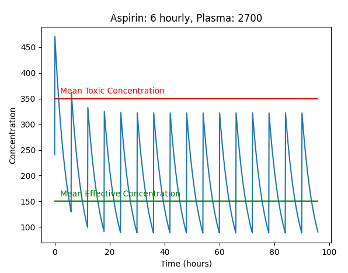

:::::::::::::::::::::::::::::::::::::: questions 

- How do I process large amounts of data?
- What support does Python have for manipulating science and engineering datasets?
- How can I get a quick visualisation (plot) of my data?

::::::::::::::::::::::::::::::::::::::::::::::::

::::::::::::::::::::::::::::::::::::: objectives

1. Use Python arrays implemented in Numpy
2. Use simple plotting techniques using matplotlib
3. Apply arrays and plotting to more complex systems dynamics problems

::::::::::::::::::::::::::::::::::::::::::::::::

### Introduction

In this practical you will be using Numpy arrays to store data. We will 
then plot data from arrays and lists before using arrays and plotting in 
some more complex systems dynamics models.

### Additional commands in VIM

VIM – additional useful commands
  
| Command | Description |
|---------|-------------------------------------------------------|
| :w | When editing a file, you can save changes so far using ```:w``` from command mode. Press ```esc``` to go from insert to command mode. |
| :w filename | If you want to save a file with a new name from vim command mode, type ```:w new_file_name``` |
| :q! | To quit without saving changes, use ```:q!``` (also good for backing out if you accidentally put the wrong file name in, e.g. ```vim grwth.py```) |
| D | To delete the rest of a line (from current cursor position in command mode), type ```D``` |
| R | To replace the rest of a line (from current cursor position in command mode), type ```R```, puts you into insert mode|
| u | To undo a command or change, type ```u```, repeat to undo multiple |
| xG | To go to a line 20 in a file, type ```20G```. To go to the last line of a file, type ```G``` |
| A | Appends after the end of the current line, puts into insert mode |

On occasion, you may accidentally hit ```ctrl-z``` when using vim or other programs. This pauses the program, 
but it is still running in the “background”. Type ```fg``` to bring it back into the foreground. When this happens, 
or if you close your machine without saving the files, a temporary file that vim creates is left behind (when 
you save and quit normally, the file is deleted). If you type ```ls -la```, you can see these “hidden” files – 
they start with a “.”, eg. ```.growth.py.swp```. 
Once you have your file back in order, you can delete the temp files using ```rm .growth.py.swp```.

### Activity 1 - Plotting Growth

The lectures notes gave modified code for ```growth.py``` to plot the output. 
Copy ```growth.py``` from your ```Prac01``` directory into your ```Prac03``` directory. 
Rename it ```growthplot.py``` and update the documentation at the start of the program. 
Then make the changes as indicated in the lecture notes. This includes inserting code 
for importing matplotlib; creating and appending to lists; and plotting the data.

Run the program and confirm that it plots your data.

Make the following modifications to your code (do each modification and confirm it works before moving onto the next one):

1. Change the colour of the plotted line from blue to red
2. Change the symbol for the plotted line to a triangle. Note that the line is
formed from many individual data points, these are joined together when we
use a line in our plot
3. Change the simulation time from 10 hour to 100 hours, now we can see the
exponential growth in the population
4. Change the plotting back to a line
5. Change the plot title to “Prac 3.1: Unconstrained Growth”
6. Save the plot to your ```Prac03``` directory

### Activity 2 - Reading Numbers with Arrays

In ```Prac01``` we read in ten numbers and printed their total. Copy ```num_for.py``` 
from ```Prac01``` to ```Prac03/numbersarray.py```. We will change this file to use arrays to 
store the values and then print some summary data. 

Make the changes below and run the program:
 
```python
#
# numbersarray.py: Read ten numbers give sum, min, max & mean 
#
import numpy as np

numarray = np.zeros(10)   # create an empty 10 element array 

print('Enter ten numbers...')

for i in range(len(numarray)):
    print('Enter a number (', i, ')...')
    numarray[i] = int(input())
    
print('Total is ', numarray.sum())
```

Modify the code to:

1. Print the min and max numbers entered
2. Print the average (mean) of the numbers
3. Plot the numbers

### Activity 3 - Plotting Growth with Arrays

Copy ```growthplot.py``` to ```growtharray.py```. We will change this file 
to use arrays to store the values and then plot the arrays.

1. First, update the documentation accordingly.
2. To use Numpy arrays, we first need to import the numpy package: ```import numpy as np```.
Add the import line to the start of the program.
3. Then, create an array of zeros to hold the calculated values
4. Modify the loop code to put the values into the array
5. Modify the ```plt.plot``` call to plot the array
6. If you didn’t provide x-values for time (in hours), add code for x-values


### Activity 4 - Plotting Subplots

Copy ```growtharray.py``` to ```growthsubplot.py```. We will change this 
program to give multiple plots in the same figure.

1. Update the documentation accordingly
2. Modify the plotting code to do the do the equivalent of the subplot code in the
lecture slides (shown below). When adapting the code, the variable names and 
labels/titles will need to be changed... this is a **very** common task.
 
```python
plt.subplot(211)
plt.plot(dates, march2017, '--')  # update the xvalues, yvalues and line style
plt.title('March Temperatures')   # update title
plt.ylabel('Temperature')         # update y label units

plt.subplot(212)                  # as above... for second subplot
plt.plot(dates, march2017, 'ro')  # explore different line styles
plt.ylabel('Temperature')
plt.xlabel('Date')

plt.show()                        # display plot
```

Save the resulting plot in your ```Prac03``` directory.


### Activity 5 - Plotting a Bar Chart

Copy ```numbersarray.py``` to ```numbersbar.py```. Update ```numbersbar.py``` 
to print a bar chart of the numbers. In the lecture notes, we saw how to 
plot a bar chart from a list. We will use **similar** code to plot the numbers 
entered into ```numbersbar.py```
 
```python
plt.title('Numbers Bar Chart')
plt.xlabel('Index') 
plt.ylabel('Number')
plt.bar([0, 1, 2, 3, 4, 5, 6, 7, 8, 9], numarray, 0.9, color='purple')
plt.show()
```

Add this code to ```numbersbar.py``` to print a purple bar chart. Remember to import matplotlib!

Save it to your ```Prac03``` directory.


### Activity 6 - Systems Dynamics Revisited

In ```growth.py``` we implemented a simulation of unconstrained growth. We can use the same 
approach to simulate decay – using negative growth. In this example, we can look at a dosage 
of a drug, e.g. Aspirin for pain and Dilantin for treating epilepsy.

Download [dosage.py](files/dosage.py) and save it into your ```Prac03``` 
directory. Run the program and see if you can understand what it is doing. Look at Chapter 2 
of the text for background. The program [dosage4hr.py](files/dosage4hr.py) is a variation of ```dosage.py``` where another 
two tablets are taken after 4 hours.

Next download [repeatdosage.py](files/repeatdosage.py) and run it. MEC and MTC are values for **effective** 
and **toxic** concentrations, respectively. Note how it takes multiple doses to get up to an effective 
level. Download [skipdosage.py](files/skipdosage.py) and see the impact of skipped pills on the concentration.


*For more background information, this exercise is based on p45-50 Chapter 2 of the Shiflet & 
Shiflet textbook - http://press.princeton.edu/chapters/s2_10291.pdf .*

### Activity 7 - Exploring Aspirin Dosages

We have seen the impact of a single dose of Aspirin, and then a second after 4 hours. Many of 
these medications can have serious imnpacts if taken regularly for too long a period. An example 
would be to take the ```dosage4hr.py``` code and repeat the dosage every 4 hours... make the 
appropriate changes, which should give a result similar to the plot below.


Note that the concentration of Aspirin in the blood plasma is going above the red line, which is 
dangerous (Mean Toxic Concentration). Also  note that the blood plasma volume has/can been reduced to 2700ml, to illustrate the 
impact of changing these values.

Modifying this code to space the dosages further apart (6 hourly), we see the concentration is now always below the red line.

Also note that you probably have a double-dose at the start - as shown in the sample plots. This can be corrected by setting the 
initial aspirin_in_plasma value to zero (not ```dose```).



Another way to reduce the cumulative impacts of a medication is to not take it in the evening, so there might be 3 6-hourly doses
and a gap overnight. This can also be an approach where a medication might keep the patient awake, or not be needed while sleeping. The next plot shows how this might impact the concentration of medication in the blood plasma.


Note that these are all **models** and we know that models are **WRONG**. There are many assumptions to consider. Blood plasma
Would vary between people, and could be approximated, perhaps by weight. Drug absorption levels would vary by person, 
and by the contents of the stomach, or could be bypassed if the drug is given intravenously. Similarly, excretion 
of the drug might vary by person, and depend on their overall health. 

It is a simpistic model, however, it is incredibly useful in conveying how repat doses of drug accumulate and compund.

### Activity 8 - Scaffolded Challenge: Rainbows

Given we can draw a line plot in various colours, how might we plot a **rainbow**?


So, where might we start?

::::: challenge

::: hint

### Single curve based on a parabola

Consider how you might generate a curve. Perhaps an upside-down parabola?

```python
import matplotlib.pyplot as plt
import math

# Basic Curve
r = 5
for i in range(-r,r+1):
    plt.plot(i, r**2 - i**2,"bo")
plt.title("Basic Curve")
plt.show()
```

This code gives one curve of blue circles, but the shape is wrong.

:::

::: hint

### Single curve based on formula for a circle

A circle gives a more realistic curve... so we can use the ```x**2 + y**2 = r**2``` formula to find points on the 
edge of a circle.

```python
import matplotlib.pyplot as plt
import math

# Basic Curve
r = 5
for i in range(-r,r+1):
    plt.plot(i,math.sqrt(r**2 - i**2),color="red", marker="*")
plt.title("Basic Curve")
plt.show()
```

:::

::: hint

### Repeating the curves in reducing sizes, and progressive colours

We can use the loop index to map to a particular colour, and also to change the radius of the circle.

```python
import matplotlib.pyplot as plt
import math

# Many Curves 10,9,8,7,6
for r in range(10,5,-1):
    for i in range(-r,r+1):
        if r == 10:
            colour = "red" 
        elif r == 9:
            colour = "orange" 
        elif r == 8:
            colour = "yellow" 
        elif r == 7:
            colour = "green" 
        else:
            colour = "purple" 
        plt.plot(i,math.sqrt(r**2 - i**2),color=colour, marker="*")
plt.title("Many Curves")
plt.show()
```

:::

::: hint

### Storing values in arrays 

```python
# Many Curves - arrays
import numpy as np
res = 4
for r in range(10,3,-1):
    size = r * res * 2 + 1
    xarray = np.zeros(size)
    arcarray = np.zeros(size)
    if r == 10:
        colour = "red" 
    elif r == 9:
        colour = "orange" 
    elif r == 8:
        colour = "yellow" 
    elif r == 7:
        colour = "green" 
    elif r == 6:
        colour = "blue" 
    elif r == 5:
        colour = "indigo" 
    else:
        colour = "violet" 
    for i in range(-res * r, res * r + 1):
        xarray[i] = i
        print(r, i)
        arcarray[i] = math.sqrt((res * r)**2 - i**2)
    plt.plot(xarray, arcarray, color=colour, marker="o")
plt.title("Many Curves - arrays")
plt.show()
```

:::
 
::::::

### Submission

Update the README file to include:

- growthplot.py
- numbersarray.py
- growtharray.py
- growthsubplot.py
- numbersbar.py
- dosage.py 
- repeatdosage.py
- rainbows.py
 
along with any additional programs and charts you have created.

All of your work for this week’s practical should be submitted via Blackboard using
the Practical 03 link. This should be done as a single "zipped" file.
Submit the resulting file through Blackboard. (refer to Practical 00 or 01 for instructions
on zipping files.
 
There are no direct marks for these submissions, but they may be taken into account 
when finalising your mark for the unit. Go to the Assessment link on Blackboard and 
click on Practical 03 for the submission page.

### And that's the end of Practical 03!

::::::::::::::::::::::::::::::::::::: keypoints 

- Arrays give compact storage and additional functionality when working with collections of data **of the same type**.
- Arrays are implemented in the ```numpy``` package, which you ```import``` to be able to use them.
- Plotting data aids understanding and helps us see trends.
- We can plot using ```matplotlib```. Other packages will be explored later in the semester

:::::::::::::::::::::::::::::::::::::

:::::::::::::::::::::::::::::::::::::::::::::::: checklist

### Reflection
 
1. **Knowledge:** What are the names of the two Python packages we use for arrays and for plotting?
3. **Comprehension**: What changes if we replace plt.xlabel(‘Count’) with plt.xlabel(‘Time’)
5. **Application**: What value would you give to plt.subplot(???) to set up the 2nd plot in a 2x2 set of subplots?
7. **Analysis**: What type of file is created when we save a plot?
9. **Synthesis**: Each week we create a README file for the Prac. How is this file useful?
10. **Evaluation**: Compare the use of lists and arrays in the growth*.py programs.
Name two advantages of using lists, and two advantages of using arrays
 
::::::::::::::::::::::::::::::::::::::::::::::::

:::::::::::::::::::::::::::::::::::::::::::::::: challenge

For those who want to explore a bit more of the topics covered in this practical. Note that the challenges are not assessed but may form part of the prac tests or exam.

1. Modify ```growthsubplot.py``` to print four subplots (2x2) – the additional plots should print green squares and black triangles. (hint: subplot 1 is subplot(221))
2. Modify ```growthsubplot.py``` to print nine subplots (3x3) – the additional plots should print green squares, black triangles, black circles, black squares, blue triangles, blue circles and blue squares. (hint: subplot 1 is subplot(331))
3. Extend the aspirin simulation length in [dosage4hr.py](files/dosage4hr.py) to see what happens over time with repeated dosages
4. Modify [dosage4hr.py](files/dosage4hr.py) to see the impact of having doses every 2 hours
 
::::::::::::::::::::::::::::::::::::::::::::::::
