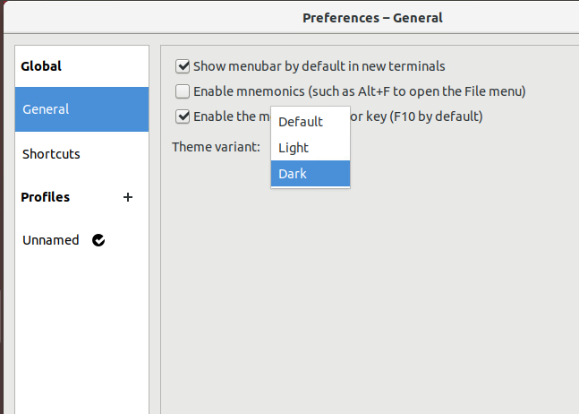
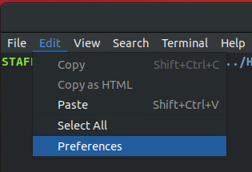

Setup instructions for home machines and mydesktop are given below.

## Software Setup

::::::::::::::::::::::::::::::::::::::: discussion

### Details

During class, we provide access to Virtual Machines [https://mydesktop.curtin.edu.au](https://mydesktop.curtin.edu.au). 
You can also use these from home via any web browser (Firefox, Chrome, Safari etc.).

A local setup is often faster, and does not rely on using the Internet. See below for options...

:::::::::::::::::::::::::::::::::::::::::::::::::::

:::::::::::::::: solution

### Windows

You will need a terminal emulator - an application that looks and works like the termainl in Linux. We recommend Gitbash, but you have quite a few options:

- [Gitbash](https://gitforwindows.org/) - an interface for the git version control system, but also a highly functional terminal program
- [Windows Sybsystem for Linux](https://learn.microsoft.com/en-us/windows/wsl/install) - Developers can access the power of both Windows and Linux at the same time on a Windows machine. Requires Windows 10 or higher
- [mobaxterm](https://mobaxterm.mobatek.net/) - MobaXterm provides all the important remote network tools (SSH, X11, RDP, VNC, FTP, MOSH, ...) and Unix commands (bash, ls, cat, sed, grep, awk, rsync, ...) to Windows desktop, in a single portable exe file which works out of the box.
- [Powershell](https://learn.microsoft.com/en-us/powershell/scripting/overview?view=powershell-7.3) - PowerShell is a modern command shell that includes the best features of other popular shells. Unlike most shells that only accept and return text, PowerShell accepts and returns .NET objects. *(I found the autocomplete unpredictable, so stopped using it)*

If you don't have Python version 3 installed, visit either of:

- [Python Software Foundation](https://www.python.org/) - the official home of Python
- [Anaconda Distribution](https://www.anaconda.com/products/distribution) - a curated set of Python tools

:::::::::::::::::::::::::

:::::::::::::::: solution

### MacOS

Use Terminal.app (type ```terminal``` in search/spotlight) and check to see that you have python installed, by typing ```python``` or ```python3```.

If you don't have Python version 3 installed, visit either of:

- [Python Software Foundation](https://www.python.org/) - the official home of Python
- [Anaconda Distribution](https://www.anaconda.com/products/distribution) - a curated set of Python tools

:::::::::::::::::::::::::


:::::::::::::::: solution

### Linux

Use Terminal and check to see that you have python installed, by typing ```python``` or ```python3```.

If you don't have Python version 3 installed, visit either of:

- [Python Software Foundation](https://www.python.org/) - the official home of Python
- [Anaconda Distribution](https://www.anaconda.com/products/distribution) - a curated set of Python tools

:::::::::::::::::::::::::

## Customising Mydesktop

### Terminal window themes

There is a lot of customisation possible with the ```terminal``` window in Linux, but we will 
just look at "light" and "dark" themes. In the terminal menu, select ```edit/prefs```.

{alt="Select edit/prefs in the terminal menu"}

Then choose ```General``` and click on Theme variant to select ```dark```.

{alt="Select dark then close"}

To go from dark to light..., in the terminal menu, select ```edit/prefs```.

{alt="Select edit/prefs in the terminal menu"}

Then choose ```General``` and click on Theme variant to select ```light```.

{alt="Select dark then close"}

### Changing the sleep settings

It may get annoying to keep putting the password in each time the virtual machine goes to sleep. The default timeout is **5 minutes**, which can be increased to 15 minutes, or to "never" (probably not a good idea). Select ```Preferences``` at the top right of the Virtual Machine and then ```Power``` to change this setting.

{alt="Select preferences and then Power at the top right of the Virtual Machine"}


